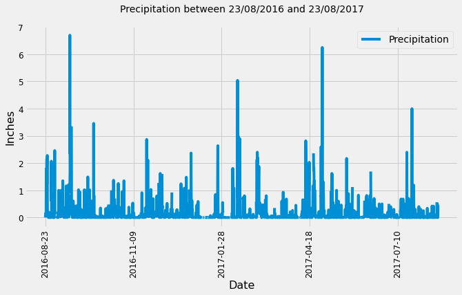
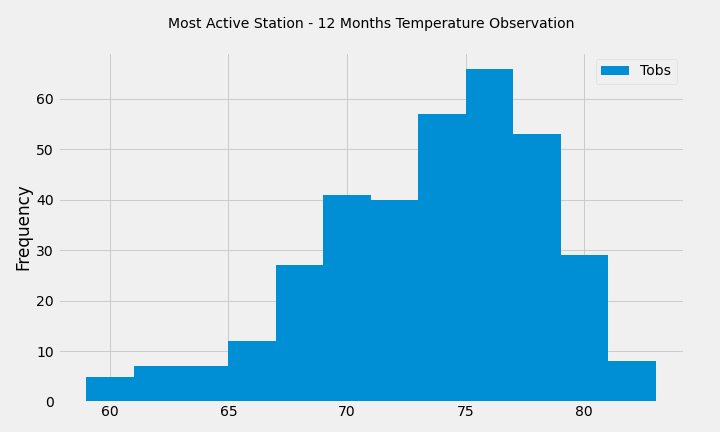

# SQLAlchemy Homework - Surfs Up!

Repository `sqlalchemy-challenge`

## Step 1 - Climate Analysis and Exploration

 
 
 ### Precipitation Analysis
  

### Station Analysis

## Step 2 - Climate App

Use Flask to create an API and define routes to find precipitation measurements and stations.  
### Temperature Analysis
### Daily Rainfall Average and Daily Temperature Normals

Analyse June and December temperature across all years in the dataset.
Use an unpair T-test to analyse the average temperatures.

